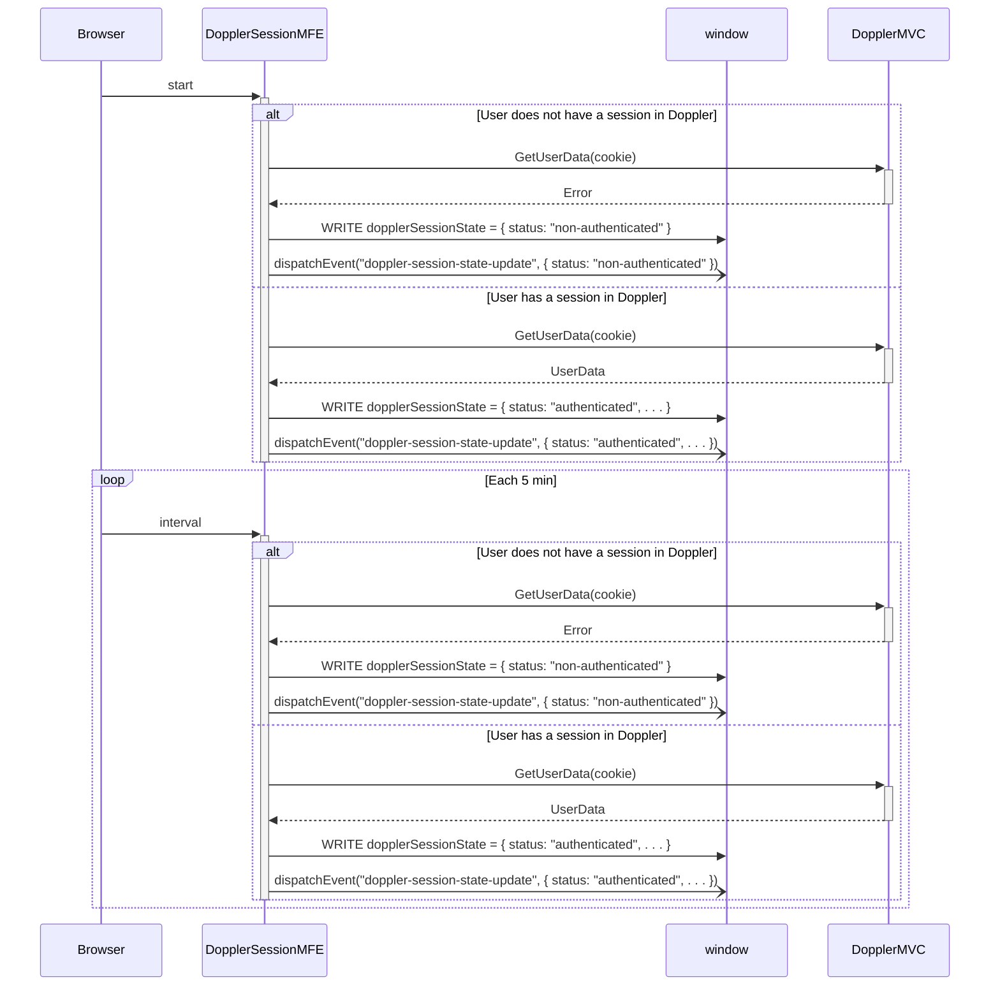
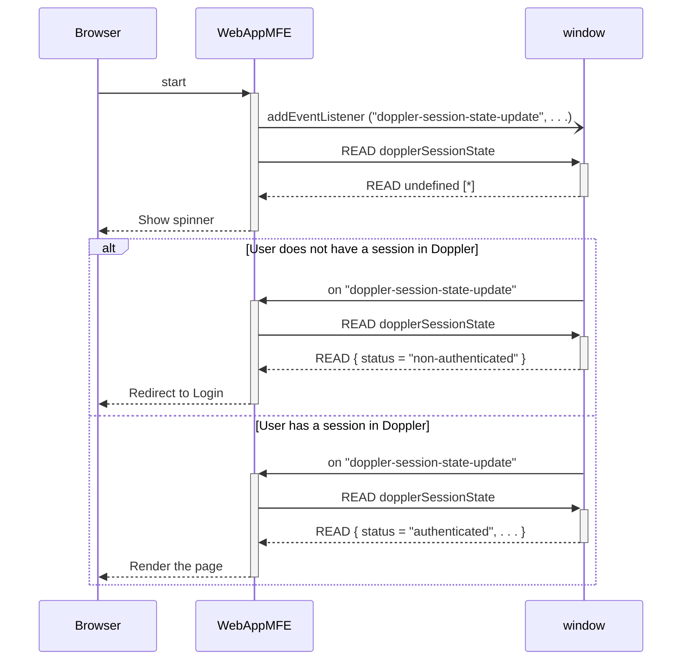

# Doppler Session Micro-Frontend

## Doppler Session Polling

Basic behavior of DopplerSession micro-frontend:

Opening a private page in a WebApp micro-frontend:

`[*]` At the moment, the first answers for `READ dopplerSessionState` will always
be `null`. But in the future, _DopplerSession micro-frontend_ is going to be improved
to cache the last session state (for example, in local storage), so the first steps
could be omitted.
